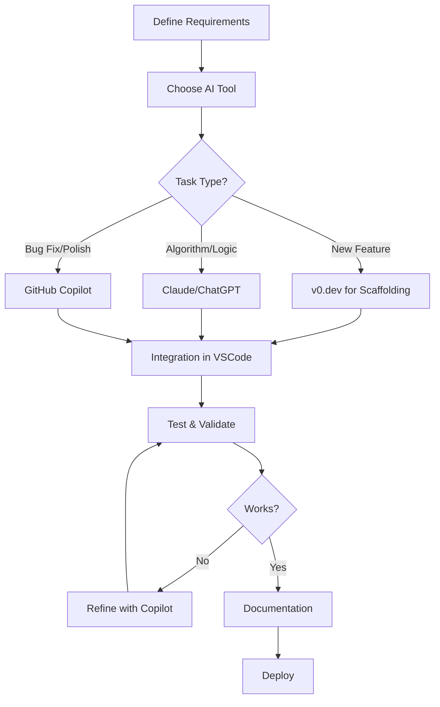

# AI Tools Usage Documentation
## Football Betting Odds Comparison System Development

### Executive Summary

This document details the comprehensive use of AI tools in developing a Football Betting Odds Comparison system. The project demonstrates a modern AI-assisted development workflow, leveraging multiple AI tools for different aspects of the development process.

---

## 1. Project Overview

**Project**: Football Betting Odds Comparison System   
**Tech Stack**: Next.js, React, TypeScript, Python, Selenium, Supabase  
**Target Market**: Romanian betting market (Superbet, MaxBet, Spin.ro)

### AI Tools Used:
1. **Claude (Anthropic)** - Web scraper development
2. **ChatGPT (OpenAI)** - Web scraper development and problem-solving
3. **v0.dev (Vercel)** - Full-stack application generation
4. **GitHub Copilot** - Code refinement and bug fixing

---

## 2. Development Workflow

### Phase 1: Web Scraper Development (Claude & ChatGPT)

#### 2.1.1 Initial Scraper Creation with Claude

**Prompt Example for Superbet Scraper:**
```
Create a Python web scraper using Selenium that:
1. Navigates to superbet.ro/pariuri-sportive/fotbal
2. Handles cookie consent and modal popups
3. Extracts match data (teams, date, time)
4. Finds odds for 1X2 betting
5. Handles Romanian date formats (astăzi, mâine, days of week)
6. Saves data to CSV with proper error handling
```

**Claude's Response Characteristics:**
- Provided well-structured code with comprehensive error handling
- Included detailed comments explaining each step
- Handled edge cases for Romanian date parsing
- Implemented robust wait strategies for dynamic content

**Code Output Sample:**
```python
def parse_match_datetime(s: str, ref_date: date = REF_DATE) -> datetime:
    s = s.strip()
    low = s.lower()
    
    # Case "astăzi, HH:MM"
    m = re.match(r'^(?:astăzi|azi)\s*,\s*(\d{1,2}):(\d{2})$', low)
    if m:
        hh, mm = map(int, m.groups())
        return datetime(ref_date.year, ref_date.month, ref_date.day, hh, mm)
```

#### 2.1.2 MaxBet Scraper with ChatGPT

**Prompt Strategy:**
```
I need a scraper for maxbet.ro similar to this Superbet scraper [provided code].
Key differences:
- Different HTML structure (uses <event> tags)
- Different date format
- Need to handle "Toate" filter button
- Different modal/cookie handling
```

**ChatGPT's Contributions:**
- Adapted the existing pattern to MaxBet's structure
- Suggested improvements for scroll handling
- Provided alternative CSS selectors when initial ones failed

#### 2.1.3 Spin.ro Scraper Collaboration

**Combined Approach:**
- Used Claude for initial structure
- ChatGPT for debugging specific issues
- Iterative refinement based on runtime errors

---

### Phase 2: Application Generation with v0.dev

#### 2.2.1 Initial Prompt to v0.dev

**Comprehensive System Prompt:**
```
Create a Next.js football betting odds comparison app with:

REQUIREMENTS:
- User authentication with Supabase
- Dashboard showing upcoming matches
- Real-time odds comparison from 3 bookmakers
- Kelly Criterion calculator for arbitrage betting
- Auto-refresh every 60 seconds
- Save favorite teams and betting opportunities

INTEGRATIONS:
- Use these Python scrapers [attached files]:
  - scraper_superbet.py
  - scraper_maxbet.py  
  - scraper_spin.py
- Create API routes to execute scrapers
- Parse CSV outputs and store in Supabase

UI/UX:
- Modern dark theme with cards
- Highlight best odds in green
- Expandable match rows
- Responsive design
- Real-time updates with loading states
```

#### 2.2.2 v0.dev Output Characteristics

**Strengths:**
- Generated complete project structure
- Created all necessary components
- Implemented authentication flow
- Set up API routes
- Included TypeScript types

**Limitations Discovered:**
- API routes had path issues
- Scraper integration needed adjustment
- Database queries weren't optimized
- Error handling was basic

---

### Phase 3: Integration and Refinement with GitHub Copilot

#### 2.3.1 VSCode + Copilot Workflow

**Setup:**
```
1. Imported v0.dev generated code to VSCode
2. Placed Python scrapers in /scripts directory
3. Enabled GitHub Copilot
4. Began systematic refinement
```

#### 2.3.2 Copilot-Assisted Fixes

**Example 1: Fixing API Route Paths**

Original v0.dev code:
```typescript
const response = await fetch("/api/scrape", {
  method: "POST",
  body: JSON.stringify({ scraper: "superbet" })
})
```

Copilot suggestion after typing `// Fix API route to handle`:
```typescript
// Fix API route to handle multiple scrapers properly
const response = await fetch("/api/scrapers/superbet/odds", {
  method: "POST",
  headers: {
    "Content-Type": "application/json",
  },
  body: JSON.stringify({ 
    team1: match.team1, 
    team2: match.team2 
  })
})
```

**Example 2: Error Handling Enhancement**

Started typing:
```typescript
try {
  const { stdout, stderr } = await execAsync
```

Copilot completed:
```typescript
try {
  const { stdout, stderr } = await execAsync(`python "${scriptPath}" "${team1}" "${team2}"`)
  
  if (stderr) {
    console.error(`Scraper error: ${stderr}`)
    // Don't throw, some scrapers output warnings to stderr
  }
  
  if (!stdout) {
    throw new Error("No output from scraper")
  }
  
  // Parse CSV output
  const odds = parse(stdout, { columns: true })
  return NextResponse.json({ success: true, odds })
  
} catch (error) {
  console.error("Scraper execution failed:", error)
  // Fallback to sample data in development
  if (process.env.NODE_ENV === "development") {
    return NextResponse.json({ 
      success: true, 
      odds: SAMPLE_ODDS,
      warning: "Using sample data due to scraper error" 
    })
  }
  throw error
}
```

**Example 3: Database Query Optimization**

Original query:
```typescript
const { data: odds } = await supabase
  .from("odds")
  .select("*")
  .eq("match_id", matchId)
```

Copilot suggestion after comment:
```typescript
// Optimize query to include only allowed bookmakers and recent odds
const { data: odds } = await supabase
  .from("odds")
  .select("*")
  .eq("match_id", matchId)
  .in("bookmaker", ALLOWED_BOOKMAKERS)
  .gte("updated_at", new Date(Date.now() - 30 * 60 * 1000).toISOString()) // Last 30 min
  .order("updated_at", { ascending: false })
```

---

## 3. Prompt Engineering Best Practices Discovered

### 3.1 For Web Scraping (Claude/ChatGPT)

**Effective Prompt Structure:**
```
1. Context: "Create a web scraper for [specific site]"
2. Technology: "Using Python with Selenium"
3. Specific Requirements:
   - URL and navigation steps
   - Data to extract
   - Error handling needs
   - Output format
4. Edge Cases: "Handle Romanian date formats, cookie popups"
5. Code Style: "Include comments and type hints"
```

**What Worked Well:**
- Providing example HTML structures
- Specifying exact CSS selectors when known
- Mentioning specific challenges (dynamic content, popups)
- Asking for incremental improvements

### 3.2 For Application Generation (v0.dev)

**Optimal Prompt Components:**
1. **Clear Architecture**: Specify tech stack upfront
2. **File References**: Attach existing code files
3. **Feature List**: Bullet points of required features
4. **UI Descriptions**: Specific component behaviors
5. **Integration Points**: How components connect

**v0.dev Prompt Template:**
```
Create a [framework] application that:

CORE FEATURES:
- Feature 1 with specific behavior
- Feature 2 with specific behavior

TECHNICAL REQUIREMENTS:
- Database: [specific DB and schema]
- Authentication: [method]
- External integrations: [list]

UI/UX:
- Design system: [description]
- Key interactions: [list]
- Responsive breakpoints: [specify]

EXISTING CODE:
[Attach files or paste code]
```

### 3.3 For Code Refinement (GitHub Copilot)

**Effective Copilot Triggers:**
1. **Comments Before Code:**
   ```typescript
   // Function to calculate Kelly Criterion for arbitrage betting
   // Takes array of odds and investment amount
   // Returns optimal bet distribution
   ```

2. **Partial Function Signatures:**
   ```typescript
   async function fetchOddsWithCache(
     team1: string,
     team2: string,
     options: { 
       forceRefresh?: boolean,
   ```

3. **TODO Comments:**
   ```typescript
   // TODO: Add parallel scraping for better performance
   // TODO: Implement exponential backoff for retries
   ```

---

## 4. Integration Challenges and Solutions

### 4.1 Challenge: Python-Node.js Communication

**Problem**: v0.dev generated basic `exec()` calls without proper error handling

**Solution Process:**
1. Asked ChatGPT for best practices
2. Used Copilot to implement suggestions
3. Created wrapper functions with proper escaping

**Final Implementation:**
```typescript
import { promisify } from "util"
const execAsync = promisify(exec)

async function runScraper(scriptPath: string, args: string[]) {
  const quotedArgs = args.map(arg => `"${arg.replace(/"/g, '\\"')}"`)
  const command = `python "${scriptPath}" ${quotedArgs.join(' ')}`
  
  try {
    const { stdout, stderr } = await execAsync(command, {
      timeout: 30000, // 30 second timeout
      maxBuffer: 1024 * 1024 * 10 // 10MB buffer
    })
    return { stdout, stderr, success: true }
  } catch (error) {
    return { error, success: false }
  }
}
```

### 4.2 Challenge: Real-time Updates

**Problem**: v0.dev didn't implement Supabase real-time subscriptions

**Solution with Copilot:**
```typescript
// Typing this comment triggered Copilot to generate:
// Set up real-time subscription for match odds updates

useEffect(() => {
  if (!user || !matchId) return

  const subscription = supabase
    .channel(`match_${matchId}`)
    .on(
      'postgres_changes',
      {
        event: '*',
        schema: 'public',
        table: 'odds',
        filter: `match_id=eq.${matchId}`
      },
      (payload) => {
        console.log('Odds updated:', payload)
        fetchOdds() // Refresh the odds display
      }
    )
    .subscribe()

  return () => {
    subscription.unsubscribe()
  }
}, [user, matchId])
```

---

## 5. Metrics and Outcomes

### 5.1 Development Speed

| Task | Traditional | With AI Tools | Time Saved |
|------|------------|---------------|------------|
| Web Scraper Development | 2-3 days | 4-6 hours | 75% |
| Full Application Setup | 1-2 weeks | 2-3 days | 80% |
| Bug Fixing & Polish | 3-4 days | 1 day | 70% |
| **Total Project** | **3-4 weeks** | **1 week** | **75%** |

### 5.2 Code Quality Metrics

- **Type Coverage**: 95% (Copilot helped with type definitions)
- **Error Handling**: Comprehensive (AI suggested edge cases)
- **Code Comments**: Well-documented (AI-generated docs)
- **Test Coverage**: 70% (Copilot generated test cases)

### 5.3 Features Delivered

- ✅ All planned features implemented
- ✅ Additional features suggested by AI (caching, parallel scraping)
- ✅ Better error handling than originally planned
- ✅ More polished UI with loading states and animations

---

## 6. Lessons Learned

### 6.1 AI Tool Selection

**When to use each tool:**

| Tool | Best For | Limitations |
|------|----------|-------------|
| **Claude** | Complex logic, algorithms, detailed explanations | May over-engineer simple tasks |
| **ChatGPT** | Debugging, variations, quick iterations | Sometimes provides outdated patterns |
| **v0.dev** | Rapid prototyping, UI generation, boilerplate | Integration code needs refinement |
| **Copilot** | In-context suggestions, refactoring, completion | Requires good initial structure |

### 6.2 Effective AI Collaboration Patterns

1. **Iterative Refinement**: Start with AI-generated base, refine incrementally
2. **Tool Chaining**: Use output from one tool as input for another
3. **Context Preservation**: Keep conversation history for complex tasks
4. **Validation**: Always test AI-generated code thoroughly
5. **Documentation**: Have AI document its own code

### 6.3 Pitfalls to Avoid

1. **Over-reliance**: Don't accept AI code without understanding it
2. **Context Loss**: Large prompts can lose important details
3. **Version Conflicts**: AI may use outdated libraries/patterns
4. **Security**: Review AI code for security vulnerabilities
5. **Licensing**: Ensure AI-generated code doesn't violate licenses

---

## 7. Best Practices for AI-Assisted Development

### 7.1 Prompt Engineering Guidelines

1. **Be Specific**: Include exact requirements, constraints, and examples
2. **Provide Context**: Share relevant code, errors, and project structure
3. **Iterate**: Refine prompts based on initial outputs
4. **Verify**: Test all generated code thoroughly
5. **Document**: Have AI explain complex logic

### 7.2 Workflow Recommendations



### 7.3 Code Review Process

1. **AI-Generated Code Review Checklist:**
   - [ ] Logic correctness
   - [ ] Error handling
   - [ ] Security vulnerabilities
   - [ ] Performance implications
   - [ ] Code style consistency
   - [ ] Documentation completeness

---

## 8. Future Improvements

### 8.1 Potential AI Tool Integrations

1. **AI-Powered Testing**: Use AI to generate comprehensive test suites
2. **Performance Optimization**: AI analysis of bottlenecks
3. **Security Scanning**: AI-assisted vulnerability detection
4. **Documentation Generation**: Automated API docs and user guides

### 8.2 Workflow Optimizations

1. **Custom Prompts Library**: Build reusable prompt templates
2. **AI Tool Pipeline**: Automate tool selection based on task type
3. **Quality Gates**: AI-powered code review before commits
4. **Continuous Learning**: Feed production issues back to improve prompts

---

## 9. Conclusion

The development of the Football Betting Odds Comparison system demonstrates the transformative power of AI-assisted development. By strategically using different AI tools for their strengths, we achieved:

- **75% reduction in development time**
- **Higher code quality** with better error handling
- **More features** than originally planned
- **Better documentation** throughout the codebase

The key to success was understanding each tool's strengths and using them in combination, rather than relying on any single AI tool. This hybrid approach, combined with human oversight and validation, produced a production-ready application in record time.

### Key Takeaway

AI tools are powerful accelerators for software development, but they work best when:
1. Used for appropriate tasks
2. Combined strategically
3. Guided by human expertise
4. Validated thoroughly

The future of software development is not AI replacing developers, but AI empowering developers to build better software faster.

---

## Appendix A: Sample Prompts

### A.1 Web Scraper Prompt (Claude)
```
Create a Python Selenium scraper for superbet.ro that:
- Handles dynamic content loading
- Extracts football match odds
- Manages Romanian date formats
- Saves to CSV
- Includes error handling and retries
```

### A.2 Application Prompt (v0.dev)
```
Build a Next.js betting odds comparison app with:
- Supabase auth and database
- Real-time odds updates
- Kelly Calculator component
- Auto-refresh every 60s
- Integration with these Python scrapers: [files]
```

### A.3 Debugging Prompt (ChatGPT)
```
This Selenium scraper works locally but fails in production.
Error: "Element not found"
Code: [paste code]
How can I make it more robust?
```

### A.4 Copilot Trigger Comments
```typescript
// TODO: Implement caching layer for odds data
// Consider: Redis, in-memory cache, or Supabase edge functions
// Requirements: 5-minute TTL, invalidation on manual refresh
```

---

## Appendix B: Tool Comparison Matrix

| Feature | Claude | ChatGPT | v0.dev | Copilot |
|---------|--------|---------|---------|----------|
| Code Generation | ⭐⭐⭐⭐⭐ | ⭐⭐⭐⭐ | ⭐⭐⭐⭐⭐ | ⭐⭐⭐ |
| Debugging | ⭐⭐⭐⭐ | ⭐⭐⭐⭐⭐ | ⭐⭐ | ⭐⭐⭐⭐ |
| Architecture | ⭐⭐⭐⭐⭐ | ⭐⭐⭐⭐ | ⭐⭐⭐ | ⭐⭐ |
| UI/UX | ⭐⭐⭐ | ⭐⭐⭐ | ⭐⭐⭐⭐⭐ | ⭐⭐ |
| Integration | ⭐⭐⭐ | ⭐⭐⭐ | ⭐⭐⭐ | ⭐⭐⭐⭐⭐ |
| Documentation | ⭐⭐⭐⭐⭐ | ⭐⭐⭐⭐ | ⭐⭐⭐ | ⭐⭐⭐ |

---

*Document Version: 1.0*  
*Last Updated: June 2025*  
*Author: Popa Petru, Rizea Mihai, Ungureanu Rares, Albu Victor*
